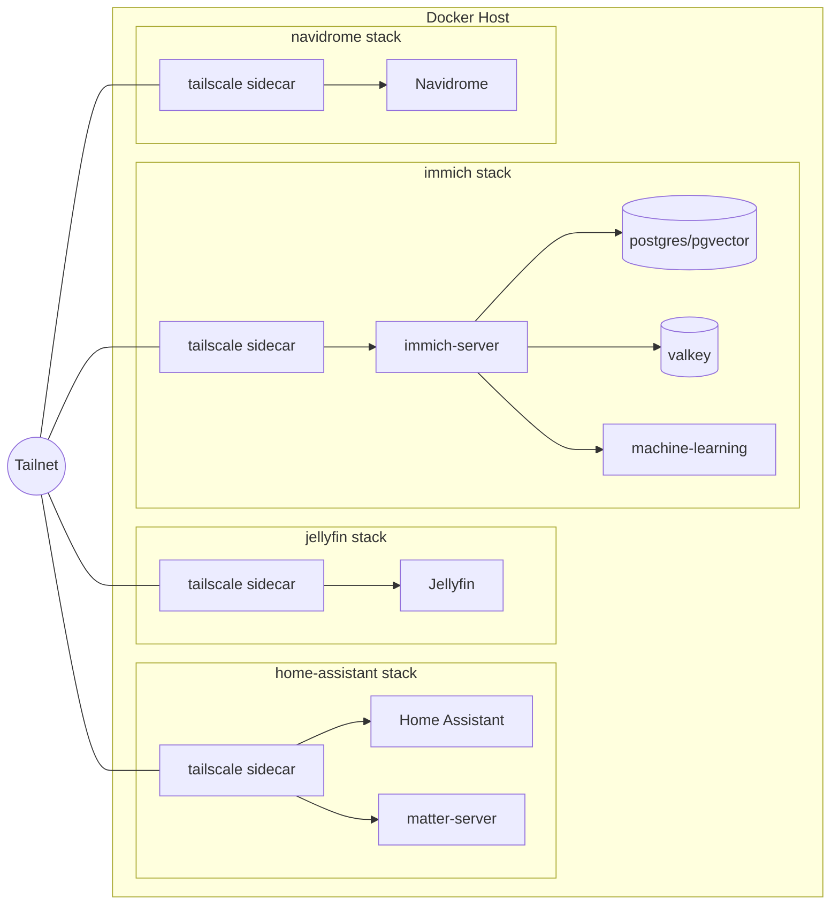

# HOME LAB

A self-hosted homelab. Each service is its own independent Docker Compose stack, and every stack is exposed privately over [Tailscale](https://tailscale.com) — reachable from anywhere on the tailnet, but never the public internet.

## Architecture

The host runs Docker. Each service directory is a standalone Compose stack that bundles the app with a Tailscale sidecar container. The app joins the sidecar's network namespace (`network_mode: service:tailscale`), and the sidecar serves the app over HTTPS on port 443 onto the tailnet.



## Access

Each service is reachable at `https://<service>.<tailnet>.ts.net` via Tailscale MagicDNS. The sidecar terminates HTTPS on port 443 using Tailscale-issued certs. `AllowFunnel` is `false` on every stack, so access is tailnet-only — nothing is published to the public internet.

## Services

- **`home-assistant/`** — Home Assistant plus a Matter server for smart-home devices. Runs privileged with host `dbus` and Bluetooth access; `TZ=Australia/Perth`.
- **`jellyfin/`** — Media server. Binds `media/` and `media2/` (read-only) as libraries, plus a custom `fonts/` dir for subtitle burn-in.
- **`immich/`** — Photo and video backup. Composed of `immich-server`, `immich-machine-learning`, `valkey` (redis), and `postgres` (pgvector). Reads `UPLOAD_LOCATION`, DB credentials, and `DB_DATA_LOCATION` from `.env`.
- **`navidrome/`** — Music streaming (OpenSubsonic). Bind-mounts `jellyfin/media/music` read-only; data in `navidrome/data/`. Shares files with Jellyfin but scrapes its own art/metadata (Last.fm + Deezer); set `ND_LASTFM_APIKEY` / `ND_LASTFM_SECRET` in `navidrome/.env`.

## Prerequisites

- Docker with the Compose plugin.
- A Tailscale auth key for the tailnet.
- A per-stack `.env` file (only `.env` is gitignored) providing at least `TS_AUTHKEY`. The `immich` stack also needs `UPLOAD_LOCATION`, `DB_DATA_LOCATION`, `DB_USERNAME`, `DB_PASSWORD`, and `DB_DATABASE_NAME`.

## Quickstart

Bring up any service from its own directory:

```bash
cd <service>          # home-assistant | jellyfin | immich | navidrome
cp .env.example .env  # or create .env with the vars above
docker compose up -d
```

Once the sidecar authenticates, the service appears on the tailnet at `https://<service>.<tailnet>.ts.net`.

## Repo layout

Each top-level directory is one Compose stack:

```
<service>/
  compose.yml          # the stack definition
  tailscale/
    config/            # Tailscale serve config (HTTPS -> app port)
    state/             # tailscale state + issued certs
  <service data dirs>  # config, cache, media, db data, etc.
```

Note: runtime data (service `config/`, `cache/`, logs, and Tailscale certs) currently lives in-repo rather than being ignored.

## Goals / TODO

No firm roadmap yet. Candidate directions to flesh out later:

- Define a backup strategy for service data and databases.
- Move secrets and Tailscale certs out of the git repo.
- Add monitoring / uptime checks across the stacks.
